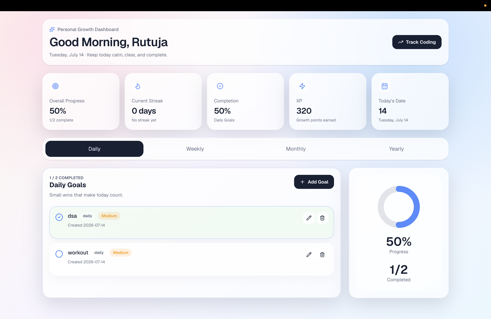
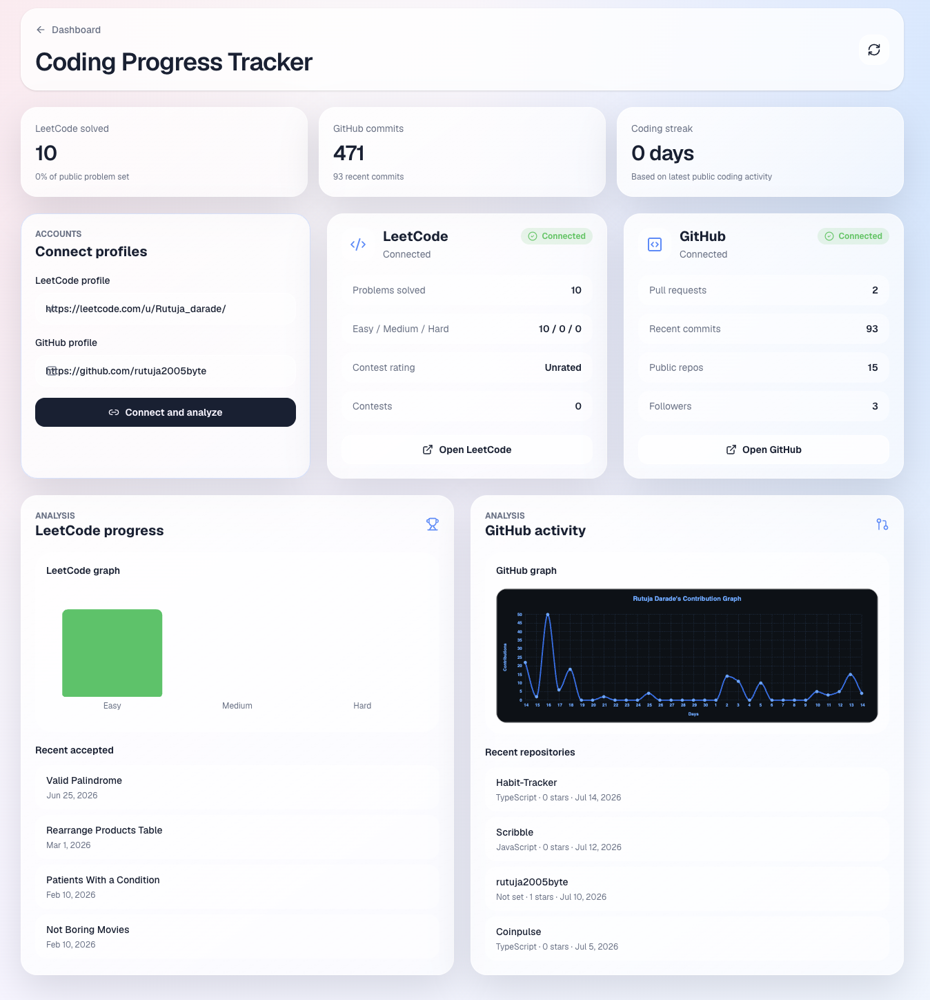

# Habit Tracker

A modern habit tracking application that helps users build consistency by tracking daily, weekly, monthly, and yearly goals. The application provides a clean and intuitive dashboard to monitor progress and maintain productive habits.

## Preview

<p align="center">
  
  
</p>


## Features

* Track daily, weekly, monthly, and yearly habits
* Create, update, and delete habits
* Monitor habit completion and progress
* Responsive and modern user interface
* Fast and optimized performance
* Clean dashboard for productivity tracking

## Tech Stack

| Category  | Technology                 |
| --------- | -------------------------- |
| Framework | Next.js                    |
| Language  | TypeScript                 |
| Styling   | Tailwind CSS               |
| Database  | *(Add your database here)* |

## Getting Started

```bash
# Clone the repository
git clone https://github.com/rutuja2005byte/Habit-Tracker.git

# Navigate to the project
cd Habit-Tracker

# Install dependencies
npm install

# Start the development server
npm run dev
```

Open `http://localhost:3000` in your browser.

## Project Structure

```text
Habit-Tracker/
├── app/
├── components/
├── lib/
├── public/
├── styles/
└── README.md
```